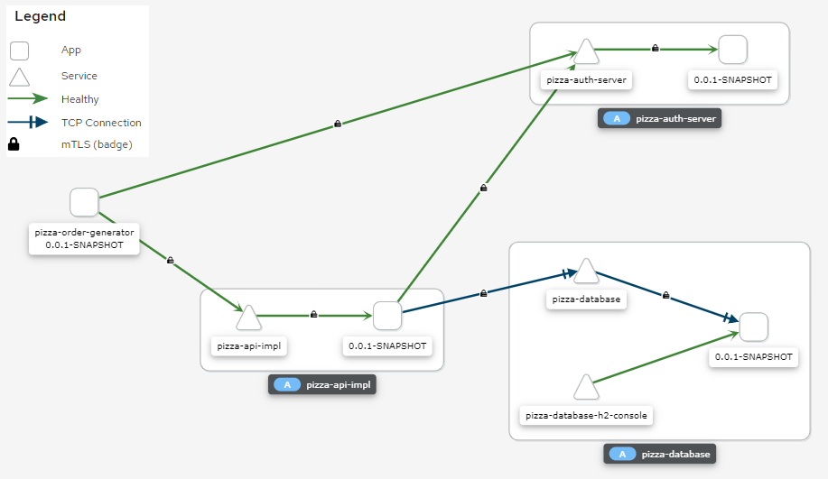
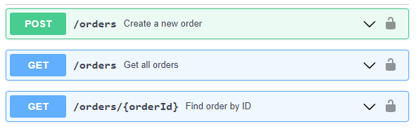
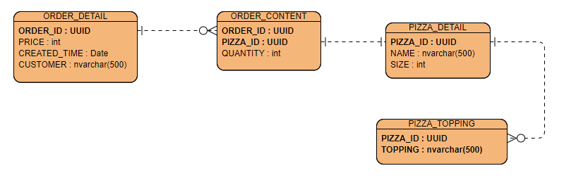
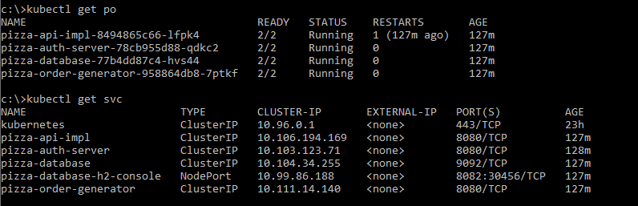
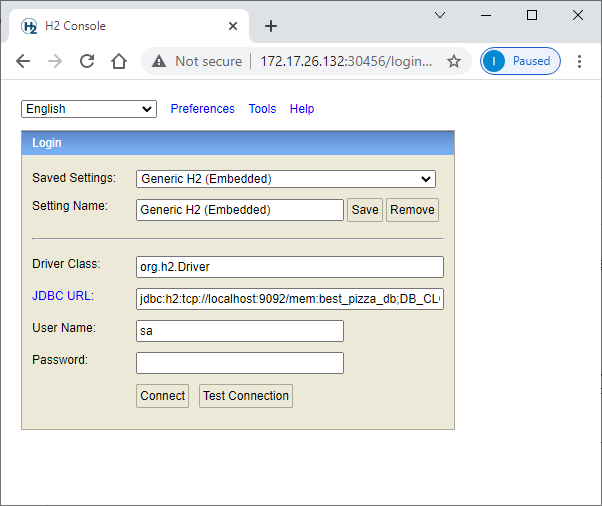
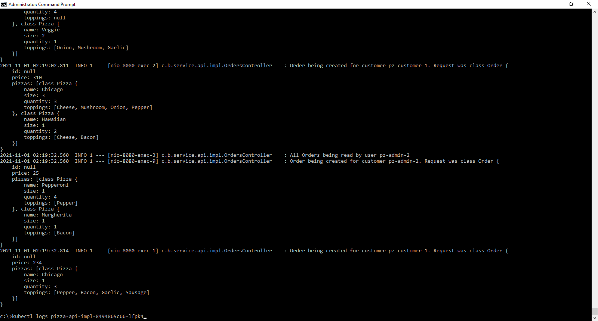

# pizza-demo
A prototype of the pizza ordering back end services running in an [**Istio Service Mesh**](https://istio.io/).

## Mechanism and connections explained
- There are 4 pods, each having 2 containers; one container being the Spring Boot app, the other being the Istio Envoy sidecar container.
  1. **pizza-auth-server** is the Authorization Server, it provides a token endpoint and a JWKS endpoint.
  2. **pizza-database** is the in-memory H2 database server without a persistent layer, it provides storage for Pizza Orders.
  3. **pizza-api-impl** is the back end service listening for Order messages and storing them to the database if valid.
  4. **pizza-order-generator** is the service generating new Order messages and sending them to **pizza-api-impl**.
- **pizza-order-generator** submits OAuth2 token requests to **pizza-auth-server**, then embed the token when making Order requests to **pizza-api-impl**.
- **pizza-api-impl** receives Order requests with JWT embedded; it visits the JWKS endpoint exposed by **pizza-auth-server** to validate the JWT.
- If the Order request is authorized and valid, **pizza-api-impl** saves the Order into **pizza-database** via JDBC (TCP).
- Inter-cluster traffic are secured by mTLS within the Istio service mesh.
- **pizza-database** exposes an extra NodePort for the Web (HTTP) H2 Console named **pizza-database-h2-console**. Developers use a browser outside of the cluster to visit this Web Console. Therefore, this traffic is not protected by mTLS.

## Pizza Order OpenAPI interface
There are only 3 operations:
- Create a new order (POST), requires OAuth2 scope *"orders.create"*.
- Retrieve all existing orders (GET), requires OAuth2 scope *"orders.read"*.
- Retrieve one existing order by order ID (GET), requires OAuth2 scope *"orders.read"*.

The OpenAPI endpoint is completely secured by OAuth2.



The OpenAPI definition is placed inside the JAR **pizza-api** to centralize the POJO generated, such that both client side and server side may reference it.

View it directly [using Swagger editor](https://editor.swagger.io/?url=https://raw.githubusercontent.com/ivanlkc/pizza-demo/main/pizza-api/src/main/resources/OrderOpenApi.yml).

One Order consists of at least one customized Pizza; each customized Pizza can contain zero or more Toppings.

A sample JSON payload of an Order looks like the following (Note that "id" should be null when creating a new Order):
```json
{
  "id": "1102b01e-7002-406f-b387-6eff15d9328e",
  "price": 429,
  "pizzas": [
    {
      "name": "BBQ",
      "size": 1,
      "quantity": 2,
      "toppings": [
        "Sausage",
        "Pepper",
        "Bacon",
        "Garlic"
      ]
    },
    {
      "name": "Margherita",
      "size": 1,
      "quantity": 1,
      "toppings": [
        "Sausage"
      ]
    },
    {
      "name": "Hawaiian",
      "size": 3,
      "quantity": 2
    }
  ]
}
```

To demonstrate the usage of OAuth2, pizza-order-generator will use two sets of OAuth2 key-secret to simulate the following:
1. A normal customer, who only have scope *"orders.create"*. He will create a new Order **every 30 seconds**.
2. An admin user, who have both scope *"orders.create"* and *"orders.read"*. He will create a new Order **every 60 seconds**, and **query all existing orders every 60 seconds**.

These key-secret and scopes are currently hard-coded in the [RegisteredClientRepository](pizza-auth-server/src/main/java/com/bestpizza/authserver/ServerConfig.java#L50).

## Database structure

## Prerequisites for development
### 1. [Apache Maven 3.8.3 or later](https://maven.apache.org/download.cgi)
### 2. JDK 11 or later
### 3. [minikube](https://minikube.sigs.k8s.io/docs/start/) running with at least 16384 MB of memory and 4 CPUs as recommended by [Istio platform setup](https://istio.io/latest/docs/setup/platform-setup/minikube/)
### 4. Istio installed and running
Follow [Istio Getting Started Guide](https://istio.io/latest/docs/setup/getting-started/) closely:
1. Install Istio with demo profile
2. Label default namespace for Envoy sidecar proxies injection
3. Install Istio sample addons
4. Open Kiali dashboard
### 5. Ensure "minikube docker-env" is effective
### 6. [lombok](https://projectlombok.org/) is required for development using IDE

## Building, deploying and running
The projects are fully integrated with JKube kubernetes-maven-plugin, so they can simply be deployed into k8s during maven build.
### 1. Clone the repository
```
git clone https://github.com/ivanlkc/pizza-demo.git
```
### 2. Delete previous deployment in kubernetes
```
mvn k8s:undeploy -Pkubernetes
```
### 3. Generate manifest to prepare for deployment
```
mvn clean k8s:resource -Pkubernetes
```
### 4. Compile, unit test, package, and send to minikube's Docker daemon
```
mvn package k8s:build -Pkubernetes
```
### 5. Deploy into Istio service mesh
```
mvn k8s:deploy -Pkubernetes -Dmaven.test.skip=true
```
### 6. Check k8s pod and service status


## Troubleshooting
### 1. Inspect the H2 database using H2 Console
A NodePort is exposed at 30456 for the H2 database management web console.
Open a browser and visit
```
http://$(minikube ip):30456
```
Then put this into JDBC URL and Connect:
```
jdbc:h2:tcp://localhost:9092/mem:best_pizza_db;DB_CLOSE_DELAY=-1
```


To use a different port number than 30456, modify [the JKube deployment YML](pizza-database/src/main/jkube/pizza-database-h2-console-service.yml).

To use a randomly assigned port, simply remove the line "nodePort: 30456".
### 2. Inspect the pod status
Every service is configured with Spring Boot 2's **readinessProbe** and **livenessProbe**. Ensure the pods status are ready.
```
kubectl get po
```
### 3. Inspect the pod logs
```
kubectl describe po <pod name>
kubectl logs <pod name>
```
Specifically, **pizza-api-impl** is the most important pod to investigate in this coding assessment.


It should periodically receive order create requests and log them.
